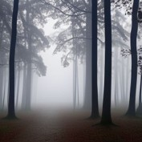
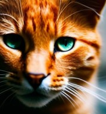
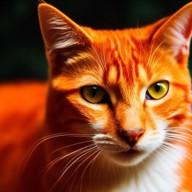
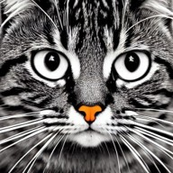
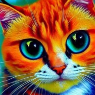

# 🖼️ Text-Driven Image Generation using Diffusion Techniques

A **Jupyter Notebook project** that implements a complete **text-to-image generation pipeline** using diffusion models — inspired by **Stable Diffusion** — built from scratch with **Hugging Face Diffusers**, **Transformers**, and **PyTorch**.

This notebook demonstrates the full diffusion pipeline:
- Text encoding using **CLIP** and **GPT-2 (MagicPrompt)**.
- Latent space denoising using **U-Net**.
- Variational Autoencoder (**VAE**) decoding.
- Prompt enhancement with **MagicPrompt** for better image quality.
- Quantitative evaluation using **CLIP score**.

---
## 🚀 Features

-  **Text-to-Image Generation** — generate 512×512 images conditioned on text prompts.
-  **Style conditioning** — choose styles like `cinematic`, `anime`, `photographic`, etc.
-  **Prompt Enhancement** — uses *Gustavosta/MagicPrompt-Stable-Diffusion* to enrich prompts.
-  **Multiple Diffusion Schedulers** — supports `LMSDiscrete`, `HeunDiscrete`, and  `DPMSolverMultistep`.
-  **CLIP-based Evaluation** — automatically computes a similarity score between prompt and generated image.
-  **GPU / MPS Acceleration** — automatically detects CUDA or MPS devices for fast inference.

---
## 🧩 Architecture Overview

The project is composed of three main components:

### 1️⃣ Autoencoder (VAE)
Encodes images into a low-dimensional latent space and decodes latents back into pixel space.  
Used only for decoding during inference.

### 2️⃣ U-Net
A convolutional encoder-decoder network that performs the denoising process in latent space, conditioned on text embeddings.

### 3️⃣ Text Encoder
Uses **CLIPTextModel** to transform input text into embeddings understandable by the U-Net.  
Additionally, a **GPT-2 (MagicPrompt)** model enriches and stylizes the text prompts.

---

## 🧮 Inference Parameters

| Parameter | Description | Default |
|------------|-------------|----------|
| `prompt` | Input text to generate image | `"an orange cat staring off with pretty eyes"` |
| `negative_prompt` | Describes what NOT to generate | various low-quality traits |
| `style` | Visual style modifier | `"cinematic"` |
| `height` / `width` | Image resolution | `512 × 512` |
| `num_inference_steps` | Denoising steps (number of iterations) | `250` |
| `guidance_scale` | Strength of text conditioning (how closely image follows prompt) | `7.5` |

---

## 🧠 Model Components

| Component | Model Name | Description |
|------------|-------------|-------------|
| **VAE** | `CompVis/stable-diffusion-v1-4` | Encodes and decodes images to/from latent space |
| **U-Net** | `CompVis/stable-diffusion-v1-4` | Performs denoising in latent space |
| **Text Encoder** | `openai/clip-vit-large-patch14` | Converts text into embeddings |
| **Prompt Enhancer** | `Gustavosta/MagicPrompt-Stable-Diffusion` | Expands and stylizes text prompts |

---

## 📊 4.1 Test Results — Prompt Diversity

The model was tested on several diverse prompts to evaluate image-text alignment (measured by **CLIP Score**).

| Prompt | CLIP Score | Output |
|---------|-------------|--------|
| A red apple on a wooden table | **29.42** |  |
| A misty forest at dawn | **28.88** |  |
| An astronaut riding a unicorn in space | **33.46** |  |
| An orange cat staring off with pretty eyes | **24.02** |  |

---

## 📈 4.2 Test Results — Style Variation

The same prompt (“an orange cat staring off with pretty eyes”) was tested across multiple visual styles.

| Style | CLIP Score | Output |
|--------|-------------|--------|
| Photographic | **23.58** |  |
| Cinematic | **25.64** |  |
| Anime | **24.48** |  |
| Line Art | **21.67** |  |
| Van Gogh | **27.13** |  |

---

 *CLIP Scores indicate how well each generated image semantically aligns with the input text prompt.*

## ⚙️ Usage
Run the notebook step by step in Jupyter: 
```bash
# 1. Clone the repository
git clone https://github.com/FloricaDolca/Text-Driven-Image-Generation-Using-Diffusion-Techniques.git
cd Text-Driven-Image-Generation-Using-Diffusion-Techniques

# 2. Install dependencies
pip install -r requirements.txt

# 3. Launch the notebook
jupyter notebook Text_Driven_Image_Generation_Using_Diffusion_Techniques.ipynb
```
This project uses models hosted on [Hugging Face Hub](https://huggingface.co/). 
At first run, log in with your account to download the required models.


